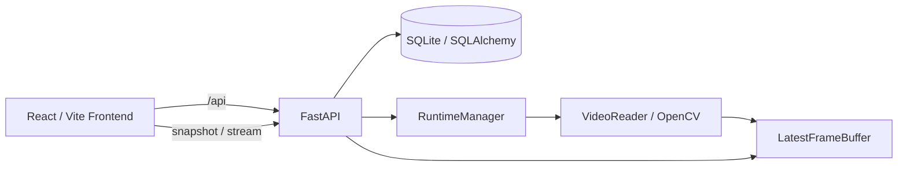
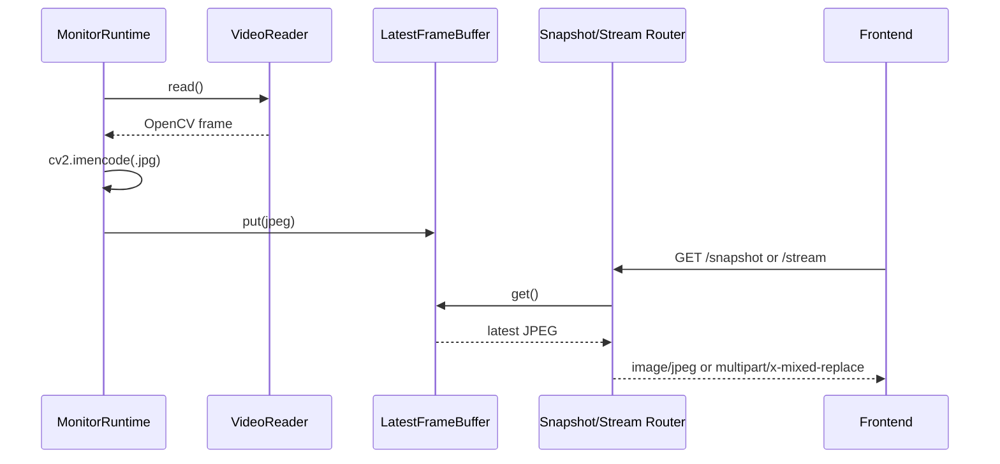
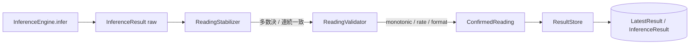

# アーキテクチャ

## システム構成



## Backendモジュール構成

- `backend/app/main.py`: FastAPIアプリ、CORS、lifespan、Router登録
- `backend/app/routers/`: HTTP API
- `backend/app/services/`: Monitor、映像ソース、Secret、Videoの処理
- `backend/app/models/`: SQLAlchemy Entity
- `backend/app/schemas/`: Pydantic入出力モデル
- `backend/app/core/`: 設定、DB、SecretStoreの基盤
- `backend/runtime/`: Monitorごとの映像Runtime、Reader、最新Frame Buffer、InferenceScheduler
- `backend/app/inference/`: 推論Engine（Ultralytics/EasyOCR/Tesseract）、Device Resolver、ModelRegistry、Diagnostics
- `backend/reading/`: Raw Reading→Confirmed Readingの時系列安定化・Validation（pure function中心）

## Frontendモジュール構成

- `frontend/src/pages/`: Dashboard、Monitor追加、Monitor詳細
- `frontend/src/components/`: Brand、映像、ソース設定、推論設定、カード
- `frontend/src/api/client.ts`: `/api`へのfetchラッパー
- `frontend/src/types.ts`: APIデータのTypeScript型
- `frontend/src/App.tsx`: Routeと全体Backgroundの構成

## レイヤ構造

```text
HTTP Router
  -> Service
      -> SQLAlchemy Model / RuntimeManager / VideoReader
  -> Pydantic Schema response
```

Frontendは`api/client.ts`からBackend APIを呼び出し、Dashboardは5秒間隔でMonitor一覧を再取得します。映像はDashboardでsnapshot URLを1秒間隔で更新し、DetailではMJPEG stream URLを`img`要素に設定します。

## 映像データフロー



`LatestFrameBuffer`はキューではなく、JPEGと更新時刻を1件だけ保持します。

## 推論・Reading Stabilizationデータフロー



`InferenceScheduler`は`ReadingStabilizer`をインスタンス属性として保持しており、Engine/Model/ROI/Preprocessing/Device変更やBackend再起動のたびに`InferenceScheduler`ごと再構築されるため、Raw Readingのbufferは自動的にresetされる。`ResultStore.save_result()`はConfirmed Readingのみを受け取り、Temporal Stabilization自体のロジックは持たない。一時的な異常値（`decrease_detected`/`rate_exceeded`/`invalid_format`等）はLatestResult.statusを変更せず静かに棄却され、直近のRaw Readingは`GET /api/monitors/{id}/reading/diagnostics`でのみ確認できる（DBには保存しない）。

`save_result()`は読取・推論状態（`LatestResult.status`、API上は`inference_status`）だけを更新し、`Monitor.status`には一切書き込まない（Issue #29）。`Monitor.status`は映像Runtime接続状態（`connecting`/`running`/`reconnecting`/`stopped`/`error`）専用のカラムで、`RuntimeManager`が`MonitorRuntime`のstatus callbackを介してのみ書き込む。両者は互いに独立しており、Dashboard/Monitor DetailのFrontendは表示用バッジを合成する際にこの2値を組み合わせる（`frontend/src/utils/monitorStatus.ts`）。

## ライフサイクル

FastAPI lifespan開始時にDBテーブルを作成し、enabledかつsourceがあるMonitorのRuntimeを開始します。終了時に`runtime_manager.stop_all()`を呼び出します。

`RuntimeManager`はMonitor IDごとに世代（generation）カウンタを持ち、`start_monitor()`でRuntimeを差し替える（または`stop_monitor()`で単に止める）たびに世代を進めます。旧`MonitorRuntime`の背後Threadは`stop()`の`join(timeout=2)`後もしばらく生存し得るため、そこから遅延して届くstatus callbackは、送出元の世代が現在の世代と一致する場合のみ`Monitor.status`へ転送されます（Issue #29）。これにより、旧Runtimeの遅延callbackが新Runtimeの正しい状態を上書きする競合を防ぎます。

