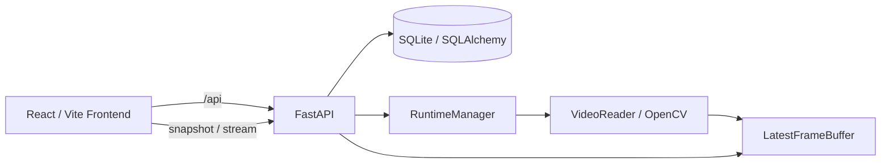
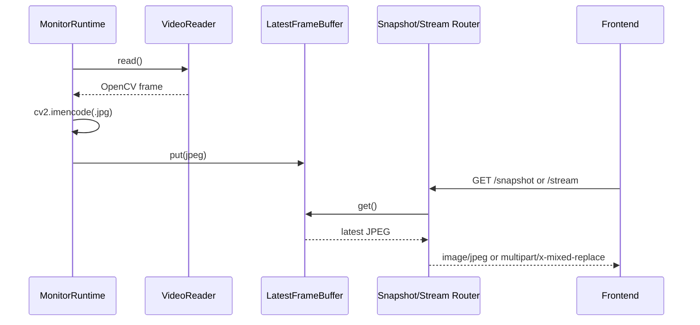

# アーキテクチャ

## システム構成



## Backendモジュール構成

- `backend/app/main.py`: FastAPIアプリ、CORS、lifespan、Router登録
- `backend/app/routers/`: HTTP API
- `backend/app/services/`: Monitor、映像ソース、Secret、Videoの処理
- `backend/app/models/`: SQLAlchemy Entity
- `backend/app/schemas/`: Pydantic入出力モデル
- `backend/app/core/`: 設定、DB、SecretStoreの基盤
- `backend/runtime/`: Monitorごとの映像Runtime、Reader、最新Frame Buffer
- `backend/app/inference/`: 推論Engineの基底・Device・Registryのinterface

## Frontendモジュール構成

- `frontend/src/pages/`: Dashboard、Monitor追加、Monitor詳細
- `frontend/src/components/`: Brand、映像、ソース設定、推論設定、カード
- `frontend/src/api/client.ts`: `/api`へのfetchラッパー
- `frontend/src/types.ts`: APIデータのTypeScript型
- `frontend/src/App.tsx`: Routeと全体Backgroundの構成

## レイヤ構造

```text
HTTP Router
  -> Service
      -> SQLAlchemy Model / RuntimeManager / VideoReader
  -> Pydantic Schema response
```

Frontendは`api/client.ts`からBackend APIを呼び出し、Dashboardは5秒間隔でMonitor一覧を再取得します。映像はDashboardでsnapshot URLを1秒間隔で更新し、DetailではMJPEG stream URLを`img`要素に設定します。

## 映像データフロー



`LatestFrameBuffer`はキューではなく、JPEGと更新時刻を1件だけ保持します。

## ライフサイクル

FastAPI lifespan開始時にDBテーブルを作成し、enabledかつsourceがあるMonitorのRuntimeを開始します。終了時に`runtime_manager.stop_all()`を呼び出します。

